# MCP Blueprint Flow Chart

This flowchart illustrates the complete workflow of the MCP (Model Context Protocol) Blueprint system, from user service request to URL provision for MCP client usage.

```mermaid
flowchart TD
    A[User Requests Service Instance] --> B[Provide Request Arguments]
    B --> C[Request Arguments Include MCP Configuration]

    C --> D{Configuration Contains}
    D --> D1[Runtime: Python/JavaScript/Docker]
    D --> D2[Package Name/Docker Image]
    D --> D3[Environment Variables]
    D --> D4[Custom Arguments]

    D1 --> E[Blueprint Receives Configuration]
    D2 --> E
    D3 --> E
    D4 --> E

    E --> F{Blueprint Job Type}
    F -->|Start Job| G[mcp_start Job Handler]
    F -->|Stop Job| H[mcp_stop Job Handler]

    G --> G1[Extract Service Instance from Tangle]
    G1 --> G2[Get Configuration from Request Args]
    G2 --> G2A[Automatically Allocate Available Port]
    G2A --> G2B[Inject PORT Environment Variable]
    G2B --> G3[Determine Runtime and Package]

    G3 --> I{Runtime Detection}
    I -->|Python| J[Python Runner - uvx]
    I -->|JavaScript| K[JavaScript Runner - bunx]
    I -->|Docker| L[Docker Runner - docker]

    %% Python Runner Flow
    J --> J1{Check if uv installed?}
    J1 -->|No| J2[Install uv via curl script]
    J1 -->|Yes| J3[Create uvx command]
    J2 --> J3
    J3 --> J4[Execute: uvx run package --args]
    J4 --> J5[Create TokioChildProcess Transport]

    %% JavaScript Runner Flow
    K --> K1{Check if bun installed?}
    K1 -->|No| K2[Install bun via curl script]
    K1 -->|Yes| K3[Create bunx command]
    K2 --> K3
    K3 --> K4[Execute: bunx -y package --args]
    K4 --> K5[Create TokioChildProcess Transport]

    %% Docker Runner Flow
    L --> L1{Check if Docker installed?}
    L1 -->|No| L2[Install Docker via get-docker.sh]
    L1 -->|Yes| L3[Check if image exists locally]
    L2 --> L3
    L3 -->|No| L4[Pull Docker image from registry]
    L3 -->|Yes| L5[Inspect image for exposed ports]
    L4 --> L5
    L5 --> L5A{Image exposes ports?}
    L5A -->|Yes| L6[Configure port binding: host port → container port]
    L5A -->|No| L6B[Skip port mapping configuration]
    L6 --> L7[Set PORT env var to container's exposed port]
    L6B --> L7B[Create container without port bindings]
    L7 --> L8[Start Docker container]
    L7B --> L8
    L8 --> L9[Attach to container streams]
    L9 --> L10[Create DockerTransport]

    %% Transport Conversion
    J5 --> M[Transport Conversion: STDIO to SSE]
    K5 --> M
    L10 --> M

    M --> N[SseServer.serve - Create HTTP Server]
    N --> N1[Bind to allocated port address]
    N1 --> N2[Setup SSE handler at /sse]
    N2 --> N3[Setup POST handler at /message]
    N3 --> N4[Forward STDIO transport to SSE transport]

    N4 --> O[MCP Server Running]
    O --> P[Return Endpoint URL to User]
    P --> P1[URL format: http://127.0.0.1:port]

    %% Store Server Information
    O --> Q[Store in McpServerManager]
    Q --> Q1[Map Service ID → Server Instance]
    Q --> Q2[Map Service ID → Owner Account]
    Q --> Q3[Map Service ID → Endpoint URL]

    %% User Usage
    P1 --> R[User Connects MCP Client to URL]
    R --> R1[Client connects to /sse endpoint]
    R1 --> R2[Establishes SSE connection]
    R2 --> R3[Receives endpoint info for POST requests]
    R3 --> R4[Client sends MCP messages via POST]
    R4 --> R5[Server forwards to MCP process via STDIO]
    R5 --> R6[MCP responses sent back via SSE stream]

    %% Stop Flow
    H --> H1[Get Service ID]
    H1 --> H2[Find Server in Manager]
    H2 --> H3[Cancel Server Token]
    H3 --> H4{Runtime Type}
    H4 -->|Python/JS| H5[Terminate Child Process]
    H4 -->|Docker| H6[Stop & Remove Container]
    H5 --> H7[Remove from Manager Maps]
    H6 --> H7
    H7 --> H8[Return Success Status]

    %% Styling
    classDef userAction fill:#e1f5fe
    classDef blueprintCore fill:#f3e5f5
    classDef runtime fill:#fff3e0
    classDef transport fill:#e8f5e8
    classDef endpoint fill:#fff8e1

    class A,B,R,R1,R2,R3,R4 userAction
    class E,F,G,G1,G2,G3,H,H1,H2,H3,H7,H8,Q,Q1,Q2,Q3 blueprintCore
    class I,J,J1,J2,J3,J4,K,K1,K2,K3,K4,L,L1,L2,L3,L4,L5,L5A,L6,L6B,L7,L7B,L8,L9,H4,H5,H6 runtime
    class J5,K5,L10,M,N,N1,N2,N3,N4 transport
    class O,P,P1,R5,R6 endpoint
```



## Key Components

### 1. **User Request Flow**

- Users request a service instance with MCP configuration
- Configuration includes runtime type, package/image, environment variables, and arguments
- Port allocation is handled automatically by the blueprint

### 2. **Blueprint Jobs**

- **mcp_start**: Handles service initialization and MCP server startup
- **mcp_stop**: Handles service termination and cleanup

### 3. **Runtime Support**

- **Python**: Uses `uv`/`uvx` for package management and execution with automatic `PORT` environment variable
- **JavaScript**: Uses `bun`/`bunx` for package management and execution with automatic `PORT` environment variable
- **Docker**: Uses Docker containers with intelligent port discovery, automatic port binding (when needed), and `PORT` environment variable injection

### 4. **Transport Conversion**

- Converts STDIO (Standard Input/Output) communication to SSE (Server-Sent Events)
- Enables HTTP-based communication for web clients
- Bidirectional message forwarding between STDIO and SSE transports

### 5. **Endpoint Provision**

- Provides HTTP URL for MCP client connections
- SSE endpoint for real-time message streaming
- POST endpoint for client message submission
- Automatic port allocation eliminates manual port configuration
- Docker images are automatically inspected for exposed ports to optimize port mapping

## 🔄 Docker Port Discovery Enhancement

**New in this version**: The Docker runtime now intelligently discovers exposed ports from Docker images:

1. **Image Inspection**: The `get_exposed_ports()` method inspects Docker images using the Docker daemon API
2. **Smart Port Mapping**: Port bindings are only configured when the image actually exposes ports
3. **Container-Aware Environment**: The `PORT` environment variable is set to the container's internal exposed port
4. **Fallback Handling**: Images without exposed ports skip port mapping entirely

### Impact on MCP Developers:

- **Docker Images**: Ensure your MCP server Docker images use `EXPOSE` instructions for ports they bind to
- **No Exposed Ports**: If your Docker image doesn't expose ports, no port mapping will be configured
- **Port Environment**: Your containerized MCP server should read the port from `$PORT` environment variable
- **Example Dockerfile**:
  ```dockerfile
  # This EXPOSE instruction will be automatically discovered
  EXPOSE 8080
  # Your app should bind to the PORT environment variable
  CMD ["./your-mcp-server", "--port", "$PORT"]
  ```

## Breaking Changes

**⚠️ Important**: Recent updates introduce automatic port management:

- **Removed**: Manual port binding configuration from user requests
- **Added**: Automatic port allocation with `PORT` environment variable injection
- **Required**: MCP servers must read port from the `PORT` environment variable

### Migration Impact:

- Configuration files no longer need `portBindings` field
- MCP servers **must** bind to the port specified in `process.env.PORT` (JS) or `os.environ['PORT']` (Python)
- Docker containers **must** expose and bind to `$PORT`

## Example Configurations

The project includes sample configurations in the `fixtures/` directory:

- **Python MCP**: [`fixtures/00_mcp_python3.json`](fixtures/00_mcp_python3.json)
- **JavaScript MCP**: [`fixtures/01_mcp_js.json`](fixtures/01_mcp_js.json)
- **Docker MCP**: [`fixtures/02_mcp_local_docker.json`](fixtures/02_mcp_local_docker.json)
- **Tangle Docker MCP**: [`fixtures/03_tangle_mcp_docker.json`](fixtures/03_tangle_mcp_docker.json)

> **Note**: All sample configurations have been updated to remove `portBindings`. Port allocation is now handled automatically by the blueprint system.
